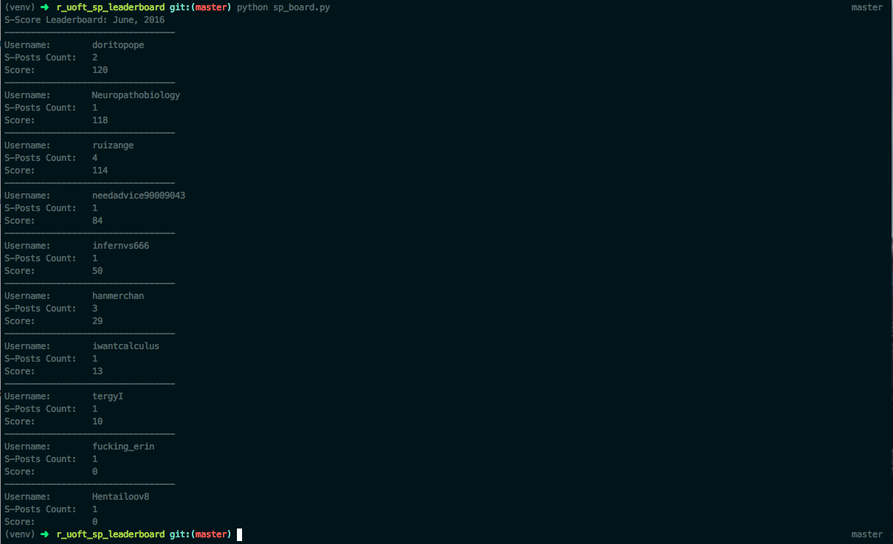

# /r/uoft SP leaderboard (monthly)

A simple monthly leaderboard for posts on /r/uoft tagged as "Shitpost"

### Prerequisites

- [python 3](https://www.python.org/download/releases/3.0/)

### Dependencies

```
$ pip install virtualenv
$ virtualenv -p /usr/local/bin/python3 venv
$ source venv/bin/activate
$ pip install -r requirements.txt
```

### Usage

`$ python sp_board.py`

### Example


